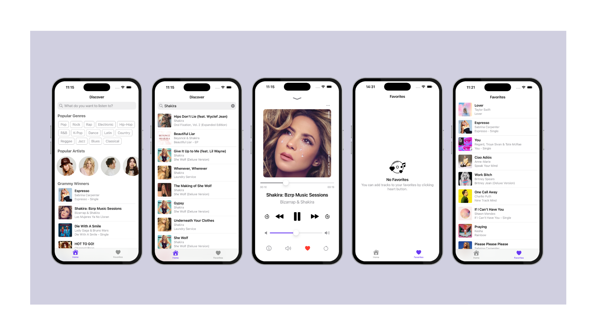

# Harmony

## Requirements
- iOS 18.0+

## Architecture
- TCA (Composable Architecture)

## Features
- Search Tracks
- Play/Pause - Loop - Turn Up/Down
- Add To Favorites

## API
- iTunes Search API (https://itunes.apple.com/search)

 ## Packages
- NukeUI 
- Composable Architecture 

## Keywords 
- Swift
- SwiftUI
- SharingGRDB (previously SwiftData)

## Roadmap

- SharingGRDB ✅
- Currently Playing ✅
- Switch Between Songs
- Pagination
- Modularization 
